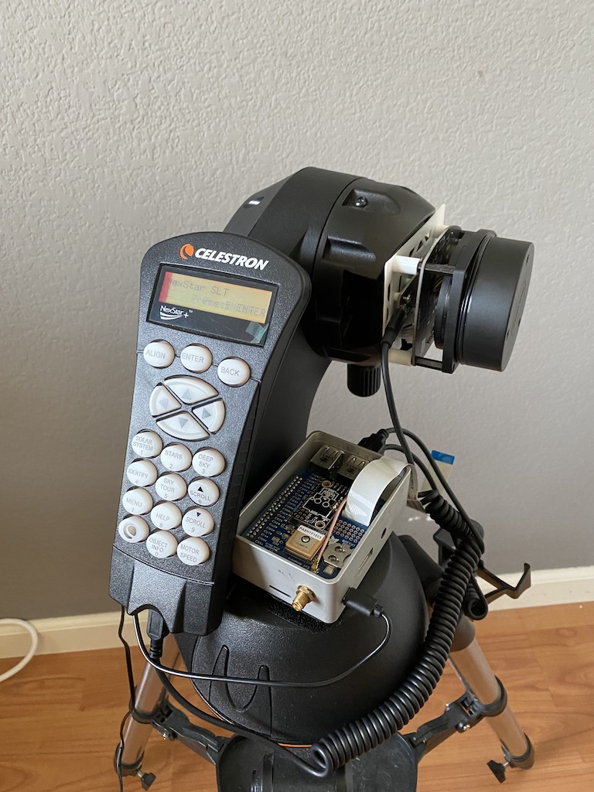

# OpenLiDAR

This project goal is to support a wide variety of sensors and controlers so people can construct their own 3D LiDAR Scanner with off-the-shelf devices. 
Please get in touch if you have a different hardware and want to contribute your solution.

The general set up consist of an affordable **LiDAR sensor** mounted on a structure that pan it around with presicion and accuracy (we call that **mount**). There are other sensors that will help your scanner to have more or better data like **GPS**, **Magnetometer** and **Camera**  

Supported **LiDAR Sensors**:

| Manufacture | Device | Driver | Range | Outdoors | Angle Resolution |
| ------------- | ------------- | ------------- | ------------- | ------------- | ------------- |
| SLAMTECH      | [RPLidar A1](https://www.slamtec.com/en/Lidar/A1) | `lidar/RPLidar.h` | 12m | no | non applicalbe | 
| SLAMTECH      | [RPLidar A2](https://www.slamtec.com/en/Lidar/A2) | `lidar/RPLidar.h` | 18m | no | 0.45° ~ 1.35° |
| SLAMTECH      | [RPLidar A3](https://www.slamtec.com/en/Lidar/A3) | `lidar/RPLidar.h` | 25m / 16m (in/outdoors) | yes | 0.3375° / 0.54° |
| SLAMTECH      | [RPLidar S1](https://www.slamtec.com/en/Lidar/S1) | `lidar/RPLidar.h` | 40m | yes | 0.391° |

Supported **Mounts**: 

| Manufacture | Device | Driver | 
| ------------- | ------------- | ------------- | 
| Celestron     | [NexStar Series](https://www.ebay.com/itm/Celestron-Astro-Fi-Computerized-GoTo-Mount-Complete-Mount-NEW/402029171407?_trkparms=aid%3D111001%26algo%3DREC.SEED%26ao%3D1%26asc%3D20160811114145%26meid%3Dac0b70c81d164dd9bf6b6775530718f0%26pid%3D100667%26rk%3D2%26rkt%3D8%26mehot%3Dnone%26sd%3D303235523326%26itm%3D402029171407%26pmt%3D0%26noa%3D1%26pg%3D2334524&_trksid=p2334524.c100667.m2042) | `mount/Celestron.h` |
| TBD           | TBD | TBD | 

Supported **GPS**:

| Manufacture | Device |
| ------------- | ------------- |
| TBD | TBD |

Supported **Magnetometers**:

| Manufacture | Device |
| ------------- | ------------- |
| TBD | TBD |

Supported **Cameras**:

| Manufacture | Device |
| ------------- | ------------- |
| TBD | TBD |


# Hardware Setups

### Celestron/RPLidarA1 (March 2020)

Because hardware is not really one of my strengths I decide to reuse existing hardware as much as possible. Avoiding 3D printing moving peaces like gears was very important because they tend to introduce error. For that I based my desing on using a motorize telescope mount which robust design have been tested extensivelly while provides maximum presicion and control. As an extra if it's properly calibrated (using their own system based on stars possition) can waranty excelent alignments of your point clouds.


* [RPLiDAR A1](https://www.dfrobot.com/search-RPLIDAR.html) I decide to go with the cheaper to see what the floor was how I can build it up from their
* [Celestron NexStar GoTo Mount](https://www.ebay.com/itm/Celestron-Astro-Fi-Computerized-GoTo-Mount-Complete-Mount-NEW/402029171407?_trkparms=aid%3D111001%26algo%3DREC.SEED%26ao%3D1%26asc%3D20160811114145%26meid%3Dac0b70c81d164dd9bf6b6775530718f0%26pid%3D100667%26rk%3D2%26rkt%3D8%26mehot%3Dnone%26sd%3D303235523326%26itm%3D402029171407%26pmt%3D0%26noa%3D1%26pg%3D2334524&_trksid=p2334524.c100667.m2042) to spin the RPLiDAR around in 360 degrees with precision (~200 U$D). 
* [Celestron compatible dovetail mount](https://www.amazon.com/gp/product/B07LGN4K6L/ref=ppx_yo_dt_b_asin_title_o02_s00?ie=UTF8&psc=1). Non-permanent solution to attach the LiDAR sensor to the Celestron mount. (~12 U$D)
* Design and 3D Print the model `models/celestron_mount/rplidar_A1.stl`. This mount attach to the celestron mount through the dovetail rail, and to the RPLidar A1 and it's driver through screws.
* [RaspberryPi](https://www.raspberrypi.org/products/raspberry-pi-4-model-b/) to control both the sensor and the mount running OpenLiDAR. I [modify my Celestron mount following this directions in order to derive power from it](https://hackaday.io/project/21088-raspberry-pi-driven-telescope-mount) (35 U$D)




# Software setup 

## Installation

Install dependencies:

```bash
sudo apt install cmake libpcl-dev libglm-dev gpsd gpsd-clients libgps-dev
```

Clone this repository:

```bash
git clone https://github.com/patriciogonzalezvivo/OpenLiDAR.git
```

Compile and Install

```bash
cd OpenLiDAR
mkdir build
cd build
cmake ..
make
```

Give your user permission to access the USB ports:

```bash
sudo usermod -a -G dialout $USER
```

## Apps

Ecosystem of apps to scann and process LiDAR data.

### `3dscan`

Makes a 3D lidar scan. To run you need to the USB addresses of the Celestron mount (first argument) and the RPLiDAR sensor (second argument). In linux systems they are given by the order you plug them. 

```bash
./3dscan --mount /dev/ttyUSB0 --lidar /dev/ttyUSB1 -speed 0.9 --degrees 180 --leaf 0.01 --normals --out point_cloud
```

# ROADMAP

OpenLiDAR `lib/`:

* Auto detect ports for devices
* Auto suggest offset values based on mount and sensor
* Multi thread method with callback (specially for creating UI interfaces)
* Add support for GPS devices
* Add support for Magnetometers
* 360 panoramic reconstruction using camera input
    * Add support for different cameras
    * RGB and Depth callibration 


Console based `app/3dscan`:

* Choose different output types: PLY, PCD, PNG
* Geotag PLYs and PCDs based on GPS data
* Add optional outliers removal


GUI app `app/3dscanx`:

* TBD

